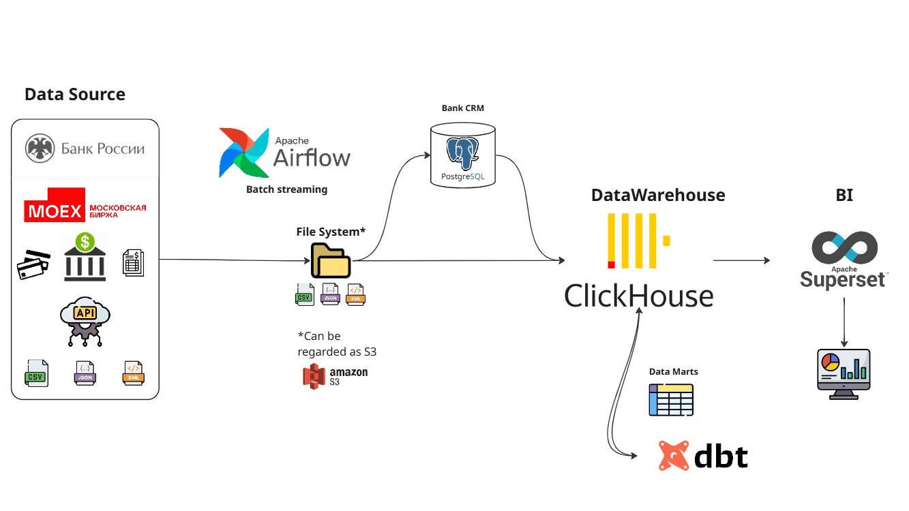

# **ETL Pipeline for financial organization** 

This project is an example of a full-fledged ETL process for organizations which are participated in finance. Open APIs and CSV tables are used as data sources.
The following stack of technologies is used in the Project:
* [Docker v4.22.1](https://www.docker.com/)
* [Postgres v15](https://www.postgresql.org/)
* [ClickHouse](https://clickhouse.com/)
* [Python v3.8](https://www.python.org/)
* [Apache Airflow v2.8.4](https://airflow.apache.org/)
* [DBT](https://www.getdbt.com/)
* [Apache Superset](https://superset.apache.org/)

## Pipeline


- Data from APIs of ["The Moscow Exchange"](https://www.moex.com/a2193), ["The Central Bank of the Russian Federation"](https://www.cbr.ru/development/SXML/) and ["Bank Financial Transactions"](https://www.kaggle.com/datasets/computingvictor/transactions-fraud-datasets) is uploaded to shared folder called "datalake" which can be regarded as S3.
- ["Bank Financial Transactions"](https://www.kaggle.com/datasets/computingvictor/transactions-fraud-datasets) data is uploaded to **PostgreSQL** database using **Apache Airflow**. It can be regarded as **CRM in Bank** back-end database.
- The other data from S3 is uploaded to **ClickHouse** database using **Apache Airflow**.
- Data marts are created using the **PostgreSQL engine**, which is part of **ClickHouse**.
- Aggregated representations of data are created via **DBT**.
- All data marts are stored in **ClickHouse**. 
- Visualization is deployed on **Apache Superset**.

## Building the Docker Images

To build the Docker images, navigate to the root directory of the project in your terminal and run the following command in background:

```shell
docker-compose up -d
```

To show all the running docker containers

```shell
docker ps
```

To stop all the docker containers

```shell
docker-compose down
```

To go inside the docker container

```shell
docker exec -it <containerID> bash
```

## Prerequisites
- Docker: Make sure you have Docker installed on your system. You can download it from [here](https://www.docker.com/products/docker-desktop).
- Docker Compose: Also ensure that Docker Compose is installed. You can find it [here](https://docs.docker.com/compose/install/).

## Services

| Service          | Port                                             | DataBase           | User     | Password |
| ---------------- | ------------------------------------------------ | ------------------ | -------- | -------- |
| Airflow          | [http://localhost:8080](http://localhost:8080/)  |                    | airflow  | airflow  |
| Airflow(meta DB) | localhost:5430                                   | airflow            | airflow  | airflow  |
| PostgreSQL       | localhost:5431                                   | postgres_publicist | admin    | admin    |
| ClickHouse       | localhost:8123                                   | data               | admin    | admin    |
| Apache Superset  |                                                  |                    |          |          |

### Source
- RESTful API ["The Moscow Exchange"](https://www.moex.com/a2193) 
- SOAP API ["The Central Bank of the Russian Federation"](https://www.cbr.ru/development/SXML/)
- ["Bank Financial Transactions"](https://www.kaggle.com/datasets/computingvictor/transactions-fraud-datasets) is uploaded from Kaggle. 

Data is located in the folder called `data_lake`.

### PostgreSQL
The PostgreSQL service is used as the backend database for Airflow. The service uses the `postgres:15` image and exposes the default PostgreSQL port `5432`. The data for the service is persisted in the `CRM_data` volume.

### Airflow

The Airflow service is split into four separate services for the webserver, scheduler, executor, worker, metadata database. Each service is built from the `Dockerfile` in the `./airflow-dev` directory. The services share common environment variables and volumes defined in the `x-airflow-common` section.